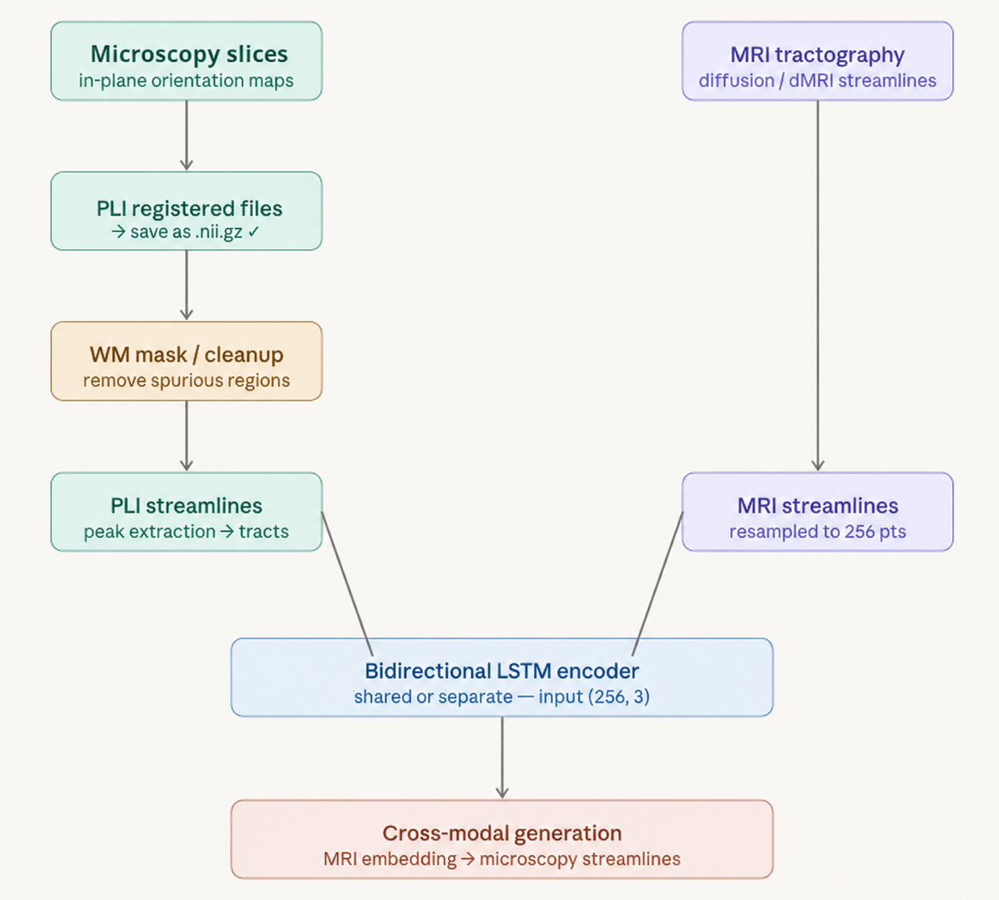

# Generative AI framework from MRI to Microscopy tractography

This framework is able to to generate microscopy tractography from MRI tractography since it is expected that the microscopy
tractography can contain more relevant details as it is based on real cell imaging and not MRI water disctribution approximation.

These are the files that need to be executed:

0. Potentially fix the affine orientation in both the MRI and microscopy
   e.g.  **python3 build_true_affine.py registered_stack_fixed_trueorient.nii.gz     registered_stack_fixed_final.nii.gz ILP --spacing None,None,100**
   and **python3 build_true_affine.py b0_fixed.nii.gz b0_fixed_trueorient.nii.gz LSP**
## MRI

1. The file to generate the tractography MRI is **generate_streamlines_MRI.py** (output a trk file)

## Microscopy
2. The microscopy data contain a lot of noise and stitching artefact which can be removed with the script
**preprocessing_pli.py**  (output a series of TIF files)

3. The microscopy data is given as a individual slices which has to be stacked and registered each other. This is done using the script 
**register_pli_stack.py** (output a nii.gz file)

4. Compute the microscopy tractography with the cleaned self-registered and registered microscopy data with the script
   **run_microscopy_tractography.py** (output a trk file), if you use a PLI use  **run_PLI_tractography.py** because PLI tractography is based on coherence of Polarized light imaging rather than structure tensor

5. In case the tractography is squeezing the z-axis, rescale it with **rescale_microscopy_trk.py**

# VAE translation

6. Train and use an  VAE going back and forth one latent space to the other.

To train the VAE:

python train.py \
  --mri dti_MRI_streamlines_Sample1.trk \
  --pli microscopy_tractography_zscaled.trk \
  --out runs/exp6 \
  --K 8 --P 32 \
  --smooth-weight 0.2 \
  --patience 25 \
  --epochs 300 \
  --device cuda

To generate a file given model and input:

python generate.py \
  --checkpoint runs/exp5/best.pt --stats-dir runs/exp5 \
  --mri dti_MRI_streamlines_Sample1.trk \
  --pli microscopy_tractography_zscaled.trk \
  --out generated_microscopy_v5.trk \
  --K 8 --P 32 --device cuda

4b. Further register the self registered stack microscopy to the original MRI volume with **PLI_MRI_Registration.py**  This has some bugs in case of very large microscopy images.
